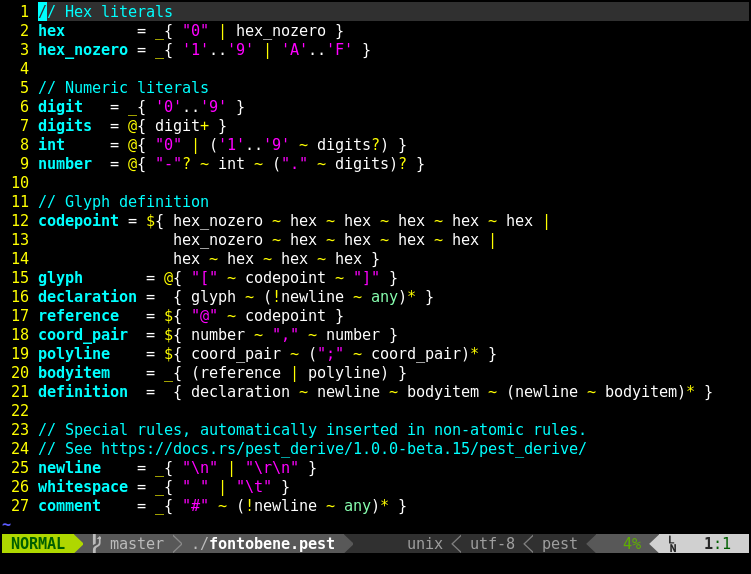

# pest.vim

Syntax highlighting for [pest](https://github.com/pest-parser/pest) PEG grammar
files.

Example (using the default color scheme):



## Installation

### Using [Vundle](https://github.com/VundleVim/Vundle.vim)

Add the following to your `vimrc`
```vimrc
Plugin 'pest-parser/pest.vim'
```

### Using [packer.nvim](https://github.com/wbthomason/packer.nvim)

```lua
use 'pest-parser/pest.vim'
```

## Neovim LSP support

### Install language server

If you're using [mason.nvim](https://github.com/williamboman/mason.nvim), run:
```vimrc
:MasonInstall pest-language-server
```

Or install it manually:
```bash
cargo install pest-language-server
```

### Set up language server

Then set it up by calling this somewhere in your neovim lua config (you may need to pass any common `opts` to this as well):
```lua
require('pest-vim').setup {}
```

If you're using `mason-lspconfig.nvim` with [Automatic server setup](https://github.com/williamboman/mason-lspconfig.nvim#automatic-server-setup-advanced-feature), you can configure it as:
```lua
require('mason-lspconfig').setup_handlers {
    ...

    ['pest_ls'] = function ()
        require('pest-vim').setup {}
    end,
    ...
}
```
